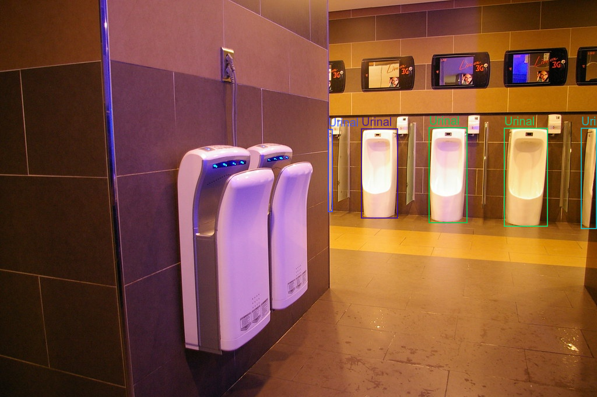
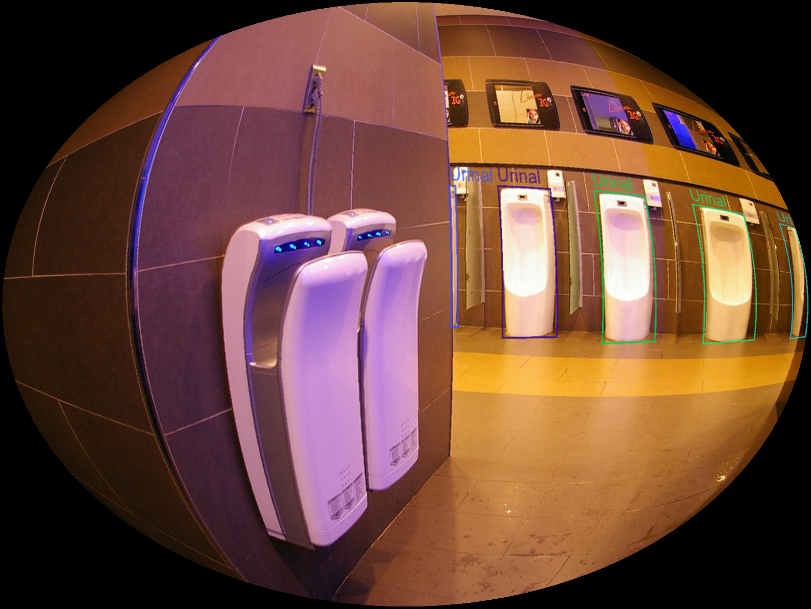
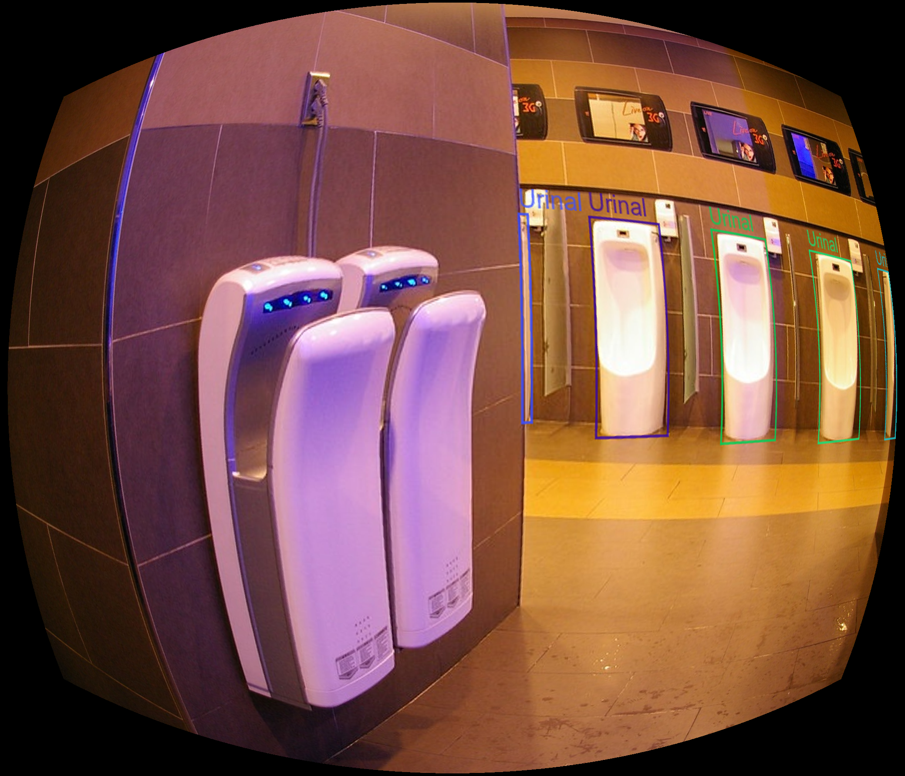
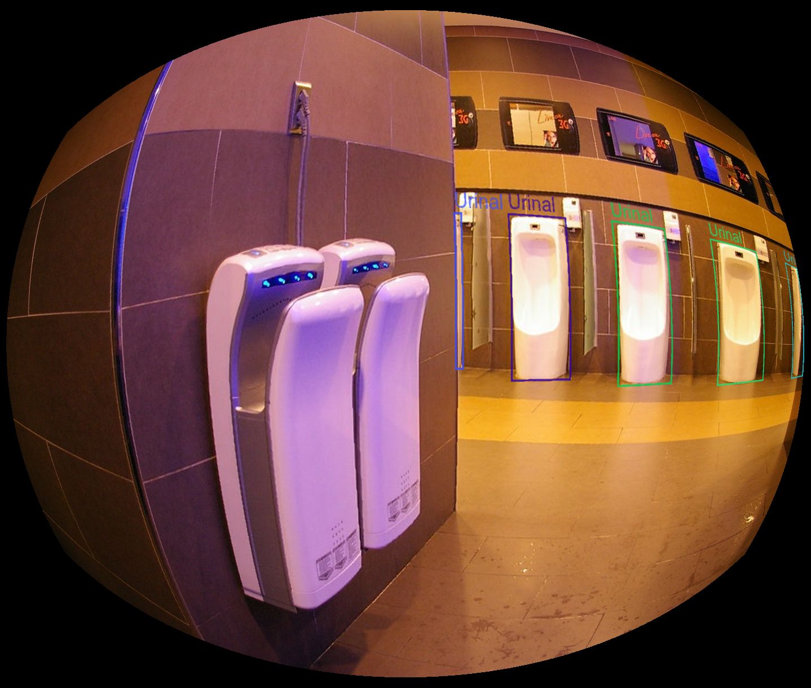
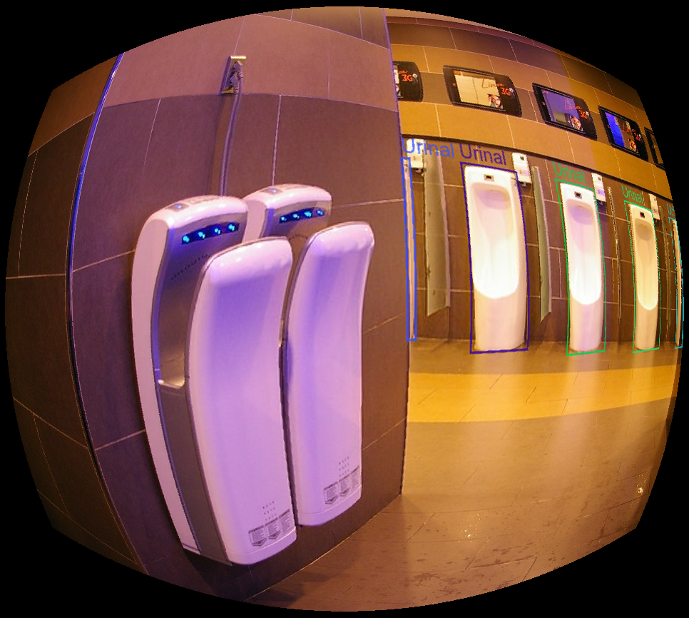
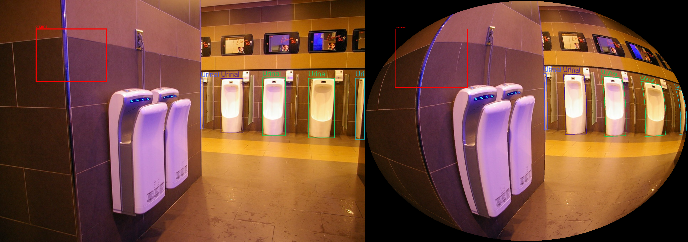

# Wide-FoV Dataset Toolkit

A reusable toolkit for generating wide-field-of-view and fisheye-style object detection datasets from standard perspective datasets.

This repository was originally developed from the transformation pipeline used to generate **RMFV365**, a large-scale multi-field-of-view extension of Objects365 introduced in our IECON 2024 paper:

**Field of View Invariant Object Recognition Using Non-Linear Transformation Augmentation**

The goal of this toolkit is to make the image and bounding-box transformation pipeline reusable for other object detection datasets, including Objects365, COCO-style datasets, YOLO-format datasets, and custom robotics, surveillance, autonomous-driving, or wide-FoV camera datasets.

---

## Why this toolkit?

Most object detection datasets are collected using standard perspective cameras. However, many real-world systems use wide-angle, panoramic, fisheye, or hemispherical cameras. These cameras introduce field-of-view changes and non-linear distortions that can reduce detector performance when models are trained only on perspective images.

This toolkit helps researchers and practitioners generate transformed training data by applying wide-FoV and fisheye-style transformations to existing object detection datasets while also transforming the corresponding bounding-box annotations.

In simple terms:

> Turn perspective object detection datasets into multi-FoV training data.

### Example transformations

| Original | Fisheye `n=7` |
|---|---|
|  |  |

| Equidistance | Square fisheye | Division model |
|---|---|---|
|  |  |  |


### Bounding-box transformation



---

## Features

- Apply wide-FoV and fisheye-style transformations to object detection images.
- Transform bounding boxes consistently with the image transformation.
- Export transformed annotations in YOLO format.
- Convert COCO/Objects365-style JSON annotations to YOLO labels.
- Generate transformed YOLO-format datasets.
- Visualize transformed bounding boxes for debugging.
- Preserve the original RMFV365 scripts for reproducibility.

---

## Supported transformations

| Transform name | Description |
|---|---|
| `fisheye_n4` | Camera/lens-independent fisheye-style transform with scaling factor `n=4` |
| `fisheye_n7` | Camera/lens-independent fisheye-style transform with scaling factor `n=7` |
| `barrel1` | Barrel distortion variant with stronger distortion |
| `barrel2` | Barrel distortion variant with milder distortion |
| `division1` | Division-model fisheye distortion variant with `d=0.38` |
| `division2` | Division-model fisheye distortion variant with `d=0.55` |
| `square_fisheye` | Square-canvas fisheye-style transform used in RMFV365 |
| `equidistance` | Equidistance projection transform used in RMFV365 |

More transformations can be added through the transform registry in:

```text
widefov/transforms/registry.py
```

---

## Repository structure

```text
wide-fov-dataset-toolkit/
├── widefov/
│   ├── annotations/
│   │   ├── bbox.py
│   ├── transforms/
│   │   ├── barrel.py
│   │   ├── common.py
│   │   ├── division.py
│   │   ├── equidistance.py
│   │   ├── fisheye_independent.py
│   │   ├── square_fisheye.py
│   │   └── registry.py
│   └── utils/
│       └── visualization.py
├── scripts/
│   ├── convert_coco_to_yolo.py
│   ├── demo_bbox_transform.py
│   ├── demo_single_image.py
│   ├── generate_yolo_dataset.py
│   └── visualize_bbox_transform.py
├── legacy/
│   ├── coordinates/
│   └── transformations/
├── examples/
│   └── sample.png
├── pyproject.toml
├── requirements.txt
├── CITATION.cff
├── LICENSE
└── README.md
```

---

## Installation

Clone the repository:

```bash
git clone https://github.com/muslim-adedamola/wide-fov-dataset-toolkit.git
cd wide-fov-dataset-toolkit
```

Install in editable mode:

```bash
pip install -e .
```

For development, including tests:

```bash
pip install -r requirements.txt
pip install -e .
```

---

## Running tests

The repository includes a small smoke-test suite to verify that all registered transformations can run on an image and return valid transformed bounding boxes.

Install the package and test dependencies:

```bash
pip install -e .
pip install pytest
```

Run the tests

```
pytest
```

Expected result:
2 passed.

---

## Expected YOLO dataset format

For YOLO-format datasets, the toolkit expects an image directory and a matching label directory.

Example:

```text
dataset/
├── images/
│   ├── image1.jpg
│   └── image2.jpg
└── labels/
    ├── image1.txt
    └── image2.txt
```

Each label file should contain normalized YOLO bounding boxes:

```text
class_id x_center y_center width height
```

Example:

```text
0 0.512500 0.483333 0.250000 0.300000
```

---

## Generate a transformed YOLO dataset

Use `scripts/generate_yolo_dataset.py` to transform images and labels together.

Example:

```bash
python scripts/generate_yolo_dataset.py \
  --images-dir dataset/images \
  --labels-dir dataset/labels \
  --output-dir outputs/dataset_fisheye_n7 \
  --transform fisheye_n7
```

This creates:

```text
outputs/dataset_fisheye_n7/
├── images/
└── labels/
```

You can use any supported transform:

```bash
--transform fisheye_n4
--transform fisheye_n7
--transform barrel1
--transform barrel2
--transform division1
--transform division2
--transform square_fisheye
--transform equidistance
```

To skip images without labels or without valid transformed labels, add:

```bash
--skip-empty
```

---

## Convert COCO/Objects365 annotations to YOLO

For COCO-style or Objects365-style annotations, first convert the JSON annotations to YOLO `.txt` labels:

```bash
python scripts/convert_coco_to_yolo.py \
  --annotations /path/to/annotations.json \
  --output-labels-dir outputs/yolo_labels \
  --skip-crowd \
  --category-mode contiguous
```

Then generate the transformed dataset:

```bash
python scripts/generate_yolo_dataset.py \
  --images-dir /path/to/images \
  --labels-dir outputs/yolo_labels \
  --output-dir outputs/transformed_dataset \
  --transform fisheye_n7
```

### Category ID modes

The converter supports two category ID modes:

| Mode | Description |
|---|---|
| `contiguous` | Maps category IDs to `0, 1, 2, ...`. Recommended for YOLO training. |
| `original` | Preserves the original COCO/Objects365 category IDs. |

---

## Transform a single image

Use this to quickly test a transformation on one image:

```bash
python scripts/demo_single_image.py \
  --image examples/sample.png \
  --output outputs/sample_fisheye_n7.png \
  --transform fisheye_n7
```

Example with another transform:

```bash
python scripts/demo_single_image.py \
  --image examples/sample.png \
  --output outputs/sample_barrel2.png \
  --transform barrel2
```

---

## Quick smoke test

After installation, you can quickly verify that the toolkit works using the included sample image:

```bash
python scripts/demo_single_image.py \
  --image examples/sample.png \
  --output outputs/sample_fisheye_n7.png \
  --transform fisheye_n7
```

You can also test all supported transformations:

```bash
for t in fisheye_n4 fisheye_n7 barrel1 barrel2 division1 division2 square_fisheye equidistance; do
  python scripts/demo_single_image.py \
    --image examples/sample.png \
    --output outputs/sample_${t}.png \
    --transform $t
done
```

---

## Transform a single bounding box

Use this to test annotation transformation numerically:

```bash
python scripts/demo_bbox_transform.py \
  --width 640 \
  --height 480 \
  --bbox 100 80 200 150 \
  --class-id 0 \
  --transform fisheye_n7
```

The bbox format is COCO-style:

```text
x y width height
```

The output is a normalized YOLO label:

```text
class_id x_center y_center width height
```

---

## Visualize transformed bounding boxes

This is useful for checking whether the transformed bounding box still aligns with the transformed object.

```bash
python scripts/visualize_bbox_transform.py \
  --image examples/sample.png \
  --bbox 100 80 200 150 \
  --output outputs/bbox_debug.png \
  --transform fisheye_n7
```

The script saves a side-by-side debug image showing:

```text
original image + original bbox
transformed image + transformed bbox
```

---

## RMFV365 workflow example

A typical RMFV365-style workflow is:

```text
COCO/Objects365 JSON annotations
        ↓
Convert annotations to YOLO labels
        ↓
Apply image transformation
        ↓
Apply matching bbox transformation
        ↓
Save transformed images and YOLO labels
```

Example commands:

```bash
python scripts/convert_coco_to_yolo.py \
  --annotations /path/to/zhiyuan_objv2_train.json \
  --output-labels-dir outputs/objects365_train_yolo \
  --skip-crowd \
  --category-mode contiguous
```

```bash
python scripts/generate_yolo_dataset.py \
  --images-dir /path/to/objects365/train/images \
  --labels-dir outputs/objects365_train_yolo \
  --output-dir outputs/objects365_train_fisheye_n7 \
  --transform fisheye_n7
```

---

## Legacy RMFV365 scripts

The `legacy/` folder contains the original scripts used in the RMFV365 experiments.

```text
legacy/
├── coordinates/
└── transformations/
```

These scripts are preserved for reproducibility and historical traceability. They may contain hardcoded paths, patch names, and output folders from the original experiments. For new work, use the cleaned toolkit interface in `widefov/` and `scripts/`.

---

## Notes on datasets and licensing

This repository provides transformation and annotation-processing code only.

It does **not** redistribute Objects365, COCO, or any third-party dataset images.

Users should download datasets from their official sources and ensure compliance with the original dataset licenses before generating transformed versions.

---

## Citation

If you use this repository or build on the RMFV365 transformation pipeline, please cite:

```bibtex
@inproceedings{alaran2024field,
  title={Field of View Invariant Object Recognition Using Non-Linear Transformation Augmentation},
  author={Alaran, Muslim and Balgabekova, Zarema and Varol, Huseyin Atakan},
  booktitle={50th Annual Conference of the IEEE Industrial Electronics Society (IECON)},
  year={2024}
}
```

---

## Acknowledgements

This toolkit is based on the transformation pipeline developed for RMFV365 and COHI-365 experiments. The original work was carried out at the Institute of Smart Systems and Artificial Intelligence, Nazarbayev University.

---

## License

- This project is released under the MIT License.

